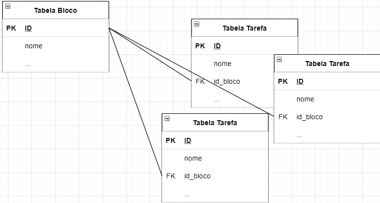
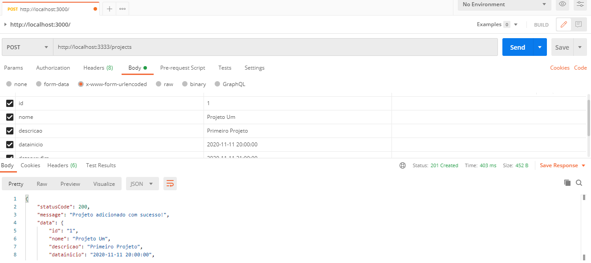
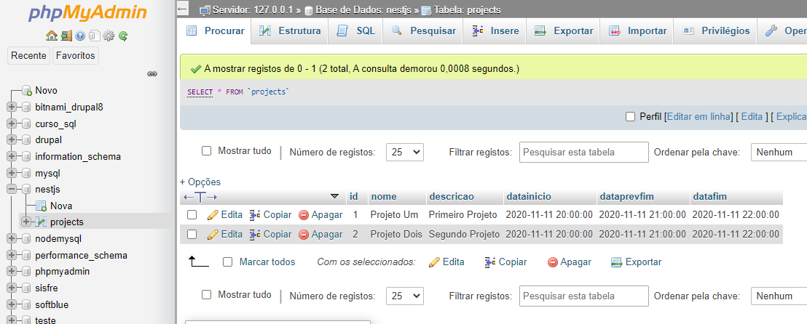

# Projeto Demonstração

> CRUD simples feito com NuxtJS e NestJS.

## Sumário
- [Projeto Demonstração](#projeto-demonstração)
  - [Sumário](#sumário)
  - [Technologies](#technologies)
  - [Setup](#setup)
  - [Organização](#organização)
  - [Criação dos módulos no NestJS](#criação-dos-módulos-no-nestjs)
  - [Banco de Dados](#banco-de-dados)
      - [Relacionamentos](#relacionamentos)
  - [NestJS](#nestjs)
    - [Testando com o Postman](#testando-com-o-postman)
  - [NuxtJS](#nuxtjs)
  - [Referência](#referência)

## Technologies
Project is created with:
* [NuxtJS](https://nuxtjs.org/): 2.14.6
* [NestJS](https://nestjs.com/): 7.5.3
* [MySql](https://www.mysql.com/): 2.18.1"

## Setup

```bash
# install dependencies
$ npm install

# serve with hot reload at localhost:3000
$ npm run dev

# build for production and launch server at localhost:3333
$ npm run build
$ npm run start

# generate static project
$ npm run generate
```

## Organização
```
projeto
├── .nuxt
├── assets
├── back
│   ├── dist
│   ├── node_modules
│   ├── src
│       ├── projects
│           ├── projects.dto.ts
│           ├── projects.entity.ts
│           ├── projects.controller.spec.ts
│           ├── projects.controller.ts
│           ├── projects.module.ts
│           ├── projects.service.spec.ts
│           ├── projects.service.ts
│       ├── blocos
│           ├── blocos.dto.ts
│           ├── ...
│           ├── blocos.service.ts
│       ├── tarefas
│           ├── tarefas.dto.ts
│           ├── ...
│           ├── tarefas.service.ts
│       ├── app.controller.spec.ts
│       ├── app.controller.ts
│       ├── app.module.ts
│       ├── app.service.ts
│       ├── main.ts
│   ├── test
│   ├── ... todo restante do NestJS ...
├── components
├── layouts
├── ... todo restante do NuxtJS ...
├── README.md

```

O projeto está dividido em duas partes, a pasta 'back' ficou com toda a parte do NestJS

## Criação dos módulos no NestJS

Após a instalação do Nest CLI e criação de um novo projeto.

Cada parte do projeto ficará em um módulo.

```
import { ProjectsService } from './projects.service';
import { ProjectsController } from './projects.controller';
import { ProjectEntity } from './project.entity';

@Module({
  imports: [TypeOrmModule.forFeature([ProjectEntity])],
  providers: [ProjectsService],
  controllers: [ProjectsController]
})
export class ProjectsModule {}
```
> back/src/projects/project.module.ts

## Banco de Dados

O projeto utiliza o [TypeORM](https://typeorm.io/#/) para gerenciar as entidades, que vai mapear pro banco o que vão ser as tabelas. Utilizando o MySql:
```
$ npm install mysql typeorm @nestjs/typeorm –save
```

Criado o arquivo *ormconfig.json* para configurar a conexão com o banco:

```
{
    "type": "mysql",
    "host": "localhost",
    "port": 3306,
    "username": "root",
    "password": "",
    "database": "nestjs",
    "synchronize": true,
    "entities": ["dist/**/**.entity{.ts,.js}"]
}
```
Criação das entidades baseadas nesse [modelo](https://typeorm.io/#/entities/what-is-entity). Cada módulo terá uma.

```
import { Entity, Column, PrimaryGeneratedColumn, BeforeInsert } from 'typeorm';

@Entity('projects')
export class ProjectEntity {

    @PrimaryGeneratedColumn()
    id: number;

    @Column()
    nome: string;

    @Column()
    descricao: string;

    @Column()
    datainicio: Date;
    
    @Column()
    dataprevfim: Date;
    
    @Column()
    datafim: Date;
}
```

#### Relacionamentos

* A tabela **_project_** terá um relacionamento do tipo 'um pra vários' com a table **_bloco_**, então a chave primária **_id_** da tabela **_project_** irá aparecer como chave estrangeira na table **_bloco_** com o nome **_id_projeto_**.

* A tabela **_bloco_** também um relacionamento do tipo 'um pra vários' com a tabela **_tarefa_**. Significando que o **_id_** da tabela **_bloco_** será associado a um ou mais registros da tabela **_tarefa_**.



## NestJS
### Testando com o Postman




## NuxtJS
O Nust foi manipulado apenas no index para apresentar os dados com a utilização do plugin para chamadas da API.

[Axios](https://nuxtjs.org/docs/2.x/directory-structure/plugins)

```
<script>
export default {
    async asyncData ({ $axios, params }) {
      const  post  = await $axios.$get(`http://localhost:3333/projects`)
      return { post }
    }
}
</script>

```
> pages/index.vue

## Referência
[NestJS Tutorials](http://www.nestjstutorials.com/)